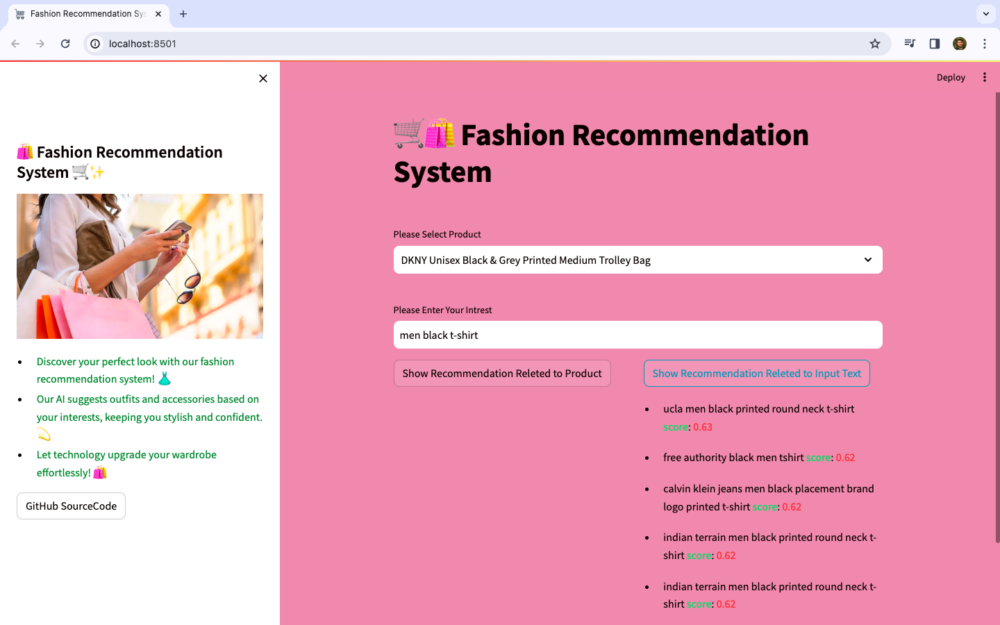
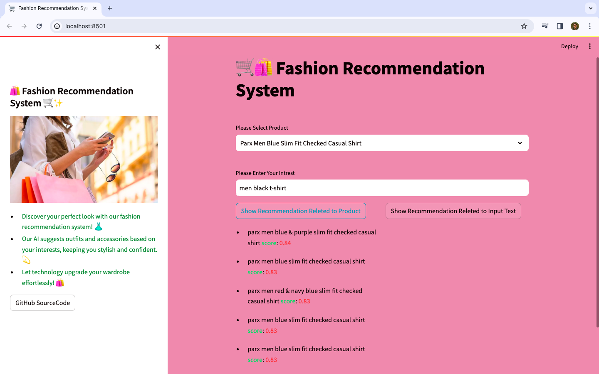

# Fashion Recommendation System

A smart fashion recommendation system powered by vector database technology that suggests clothing items based on user interests and product selections.

## 🚀 Features

- **Interest-based Recommendations**: Get personalized fashion suggestions by entering your interests
- **Product-based Recommendations**: Find similar items to products you already like
- **Vector Similarity Search**: Utilizes advanced vector embeddings for accurate semantic matching
- **Real-time Results**: Instantly displays recommendations with similarity scores

## 📊 Technology Stack

- **Frontend**: Streamlit for the interactive web interface
- **Vector Database**: Qdrant for efficient vector similarity search
- **Embeddings**: HuggingFace's sentence-transformers (all-MiniLM-L6-v2) for generating semantic embeddings
- **Data Processing**: Pandas for dataset manipulation

## 📸 Screenshots

### Recommendations by User Interest


### Recommendations by Selected Product


## 💻 Installation

1. Clone the repository:
   ```bash
   git clone https://github.com/Ashish-sinh/recommendation-using-vector-db.git
   cd recommendation-using-vector-db
   ```

2. Install the required dependencies:
   ```bash
   pip install streamlit pandas qdrant-client python-dotenv langchain
   ```

3. Set up environment variables:
   Create a `.env` file with the following variables:
   ```
   HUGGINGFACEHUB_API_TOKEN=your_huggingface_token
   QDRANT_API_KEY=your_qdrant_api_key
   ```

4. Prepare vector embeddings:
   Run the Jupyter notebook to process the dataset and store embeddings in Qdrant:
   ```bash
   jupyter notebook Save_Vector_Embeddings_in_Qdrant_Database.ipynb
   ```

5. Run the application:
   ```bash
   streamlit run app.py
   ```

## 🔄 How It Works

1. **Data Processing**: Fashion product data is processed and stored in a CSV file
2. **Embedding Generation**: Text descriptions of products are converted to vector embeddings
3. **Vector Storage**: Embeddings are stored in Qdrant vector database
4. **Similarity Search**: When a user enters text or selects a product, the system finds similar items through vector similarity
5. **Results Display**: Recommendations are displayed with similarity scores

## 🤝 Contributing

Contributions are welcome! Please feel free to submit a Pull Request.

## 📝 License

This project is open source and available under the [MIT License](LICENSE).

## 👨‍💻 Author

- **Ashish** - [GitHub Profile](https://github.com/Ashish-sinh)

